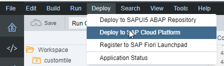
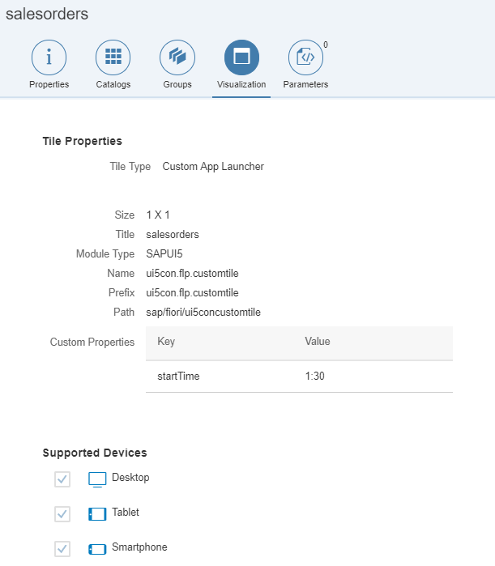
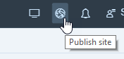

# SAP Fiori launchpad tile for SAP Cloud Platform
This is an example project for a custom SAP Fiori launchpad tile for SAP Cloud Platform

# 1. How to deploy to SAP Cloud Platform
1. **Clone or copy** this repository into SAP Web IDE
2. Press **Deploy** in the menu and then **Deploy to SAP Cloud Platfrom**

3. Select New Application and define an name, in our case "**ui5concustomtile**"

# 2. How to set-up a SAP Fiori Launchpad in SAP Cloud Platform
* You need to use the SAP Cloud Platform **Portal** service, see official documentation for**
** [Portal on Neo Environment](https://help.hana.ondemand.com/cloud_portal/frameset.htm?69000b4a09b54f33bef1b58a1dbb4001.html) or
** [Portal on Cloud Foundry Environment](https://help.hana.ondemand.com/cloud_portal/frameset.htm?c6984678cb4a475ea82cefdcf15a840d.html)

# 3. How to configure the custom tile in Fiori Configuration Cockpit
1. **Edit** the site you just created
2. Add a new app under **Content Management** > **Apps** (which one does not matter so much)
3. Under the tab **Visualization** you need to enter the following properties as shown in the image but remember to use the your app name in case you did not use "**ui5concustomtile**"

4. Add the app to a **Catalog** and a **Group**
5. **Publish** the side via the **globe icon** and click **Publish and Open**

 
